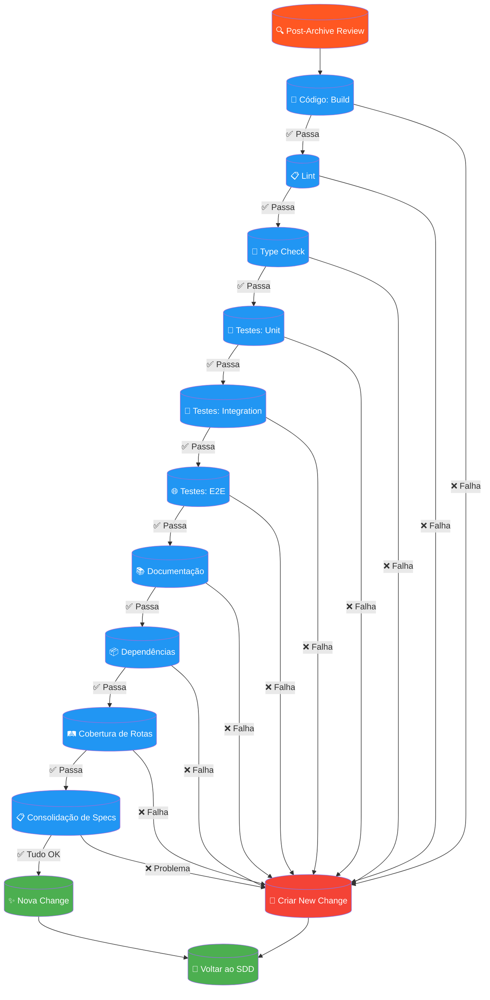

# Post-Archive Review

Workflow de verificação obrigatória após cada change ser arquivada — código, documentação e testes.

## 6 Fases da Verificação

| Fase | Verificação | Ferramentas |
|------|-------------|-------------|
| 1 | **Código** | Build, Lint, Type Check |
| 2 | **Testes Unitários** | Vitest / Jest |
| 3 | **Testes Integration** | Vitest |
| 4 | **Testes E2E** | Playwright |
| 5 | **Documentação** | Docs atualizadas |
| 6 | **Dependências + Rotas + Specs** | Consolidação final |

**Loop**: Se todas as verificações passarem → nova change SDD. Se qualquer falha ocorrer → criar new change para correção.
