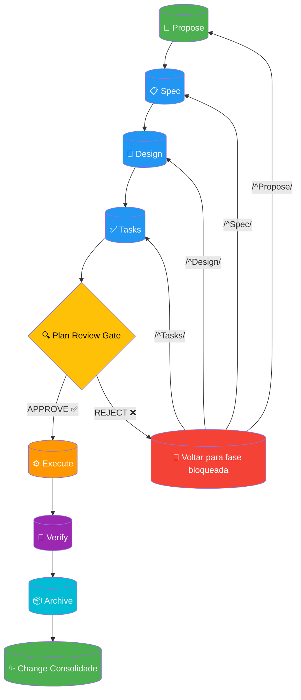

# SDD Pipeline

Workflow completo do Software Design and Delivery (SDD) com portões de qualidade em cada fase de transição.

**Portão de Revisão**: A fase `[Plan Review Gate]` pode aprovar ou rejeitar. Em caso de rejeição, o fluxo retorna para a fase apropriada (`Propose`, `Spec`, `Design` ou `Tasks`) para correções antes de prosseguir.
