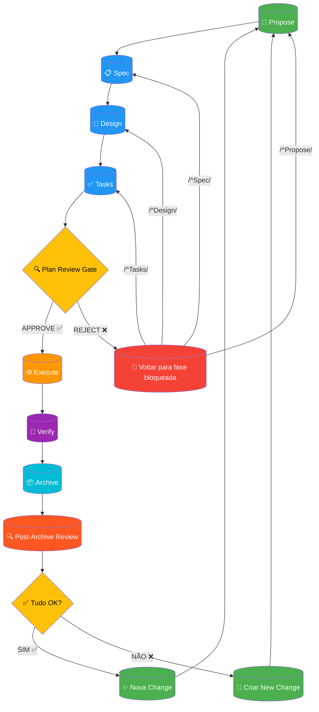

# SDD + Post-Archive Integration

Workflow completo do SDD integrado com a revisão obrigatória pós-arquivamento.

**Integração Post-Archive**: Após o arquivamento, o fluxo entra na fase de `Post-Archive Review` que executa verificações finais. Se tudo estiver OK, inicia-se uma nova change. Se houver problema, cria-se uma nova change para correção.
